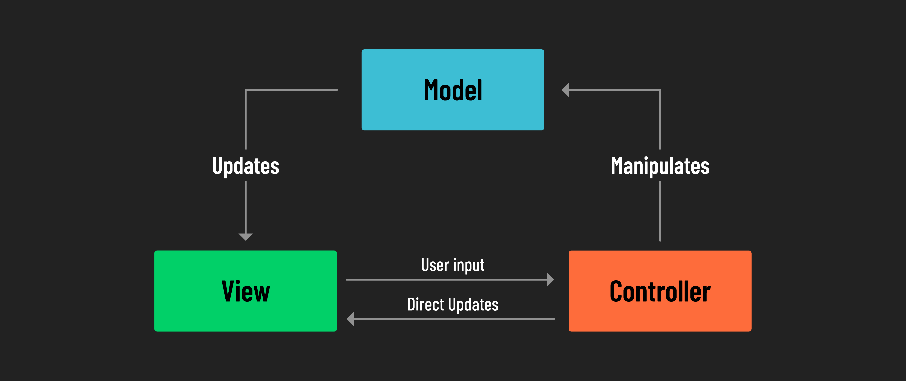

# 

**Learning objective:** By the end of this lesson, students will be able to understand and explain the Model-View-Controller (MVC) architecture in web and app development. 

## What is MVC?

MVC stands for Model-View-Controller and is a key approach in building applications. It organizes an app into three connected but separate parts.

 - **Model:** The Model is a source of truth for the structure and format of data as it moves in and out of the application.

 - **View:** The View is what users see and interact with on their screens. It's the visual side of the app, displaying information from the Model in an organized and presentable way.

 - **Controller:** The Controller acts as a middleman between the Model and the View. It deals with user inputs, processes them, and then ensures the right feedback is shown to the user through the View.

## Why Use MVC?

Using MVC in development brings many benefits, making coding easier and more efficient. This approach splits an application into three parts: data management (Model), user interface (View), and interactive logic (Controller). This clear separation improves not just ease of use but also the flexibility and long-term upkeep of the application.

Key benefits include:

 - Structured Organization: MVC clearly defines different roles and responsibilities in the application, leading to better-organized code.
 - Easier Maintenance: Changes in one area, like the design of the interface, don't mess up other parts, such as data handling.
 - Scalability: As your application gets bigger, MVC helps you handle and update each part on its own.
 - Better Teamwork: Different people or teams can work on separate parts of the application without getting in each other's way, making the whole development process smoother.

## Use of MVC

MVC is more than just an idea. It's a practical design pattern widely adopted in making websites and apps. MVC forms the core of many popular tools and frameworks that developers use, like ASP.NET MVC, Ruby on Rails, and AngularJS. But its usefulness doesn't stop there. MVC is also a key part of many systems for building and handling websites, known as Content Management Systems (CMS), such as WordPress and Joomla. This pattern isn't only for small or simple sites; it's equally important in larger, more complex projects like online stores and social media platforms. MVC is popular because it helps keep the development and management of web projects, big or small, organized and straightforward.
